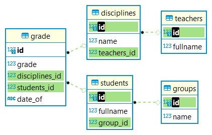

# goit_python_web_hw_06

## Завдання
### Основне завдання

Реалізуйте базу даних, схема якої містить:

* Таблиця студентів;
* Таблицю груп;
* Таблицю викладачів;
* Таблицю предметів із вказівкою викладача, який читає предмет;
* Таблицю, де у кожного студента є оцінки з предметів із * зазначенням коли оцінку отримано;

Заповніть отриману базу даних випадковими даними (~30-50 студентів, 3 групи, 5-8 предметів, 3-5 викладачів, до 20 оцінок у кожного студента з усіх предметів). Використовуйте пакет Faker для наповнення.

Зробити такі вибірки з отриманої бази даних:

* Знайти 5 студентів із найбільшим середнім балом з усіх предметів.
* Знайти студента із найвищим середнім балом з певного предмета.
* Знайти середній бал у групах з певного предмета.
* Знайти середній бал на потоці (по всій таблиці оцінок).
* Знайти які курси читає певний викладач.
* Знайти список студентів у певній групі.
* Знайти оцінки студентів у окремій групі з певного предмета.
* Знайти середній бал, який ставить певний викладач зі своїх предметів.
* Знайти список курсів, які відвідує студент.
* Список курсів, які певному студенту читає певний викладач.

Для кожного запиту оформити окремий файл query_number.sql, де замість number підставити номер запиту. Файл містить SQL інструкцію, яку можна виконати як у терміналі бази даних, так і через cursor.execute(sql)

### Додаткове завдання

Для додаткового завдання зробіть такі запити підвищеної складності:

* Середній бал, який певний викладач ставить певному студентові.
* Оцінки студентів у певній групі з певного предмета на останньому занятті.


## Рішення
###  SQL таблиці

Тека "sql", файли:         
* "create_table_groups.sql"
* "create_table_students.sql"
* "create_table_disciplies.sql"
* "create_table_teachers.sql"
* "create_table_grade.sql"

#### SQL діаграма


### SEEDS DATA
#### SELECT * FROM teachers 
```
id|fullname          |
--+------------------+
 1|    Клавдія Девдюк|
 2|    Тереза Фаренюк|
 3| Клавдія Василенко|
 4|Нестор Ємельяненко|
 5|   Василина Масляк|
 6|  Василина Хоменко|
 7|   Олександр Корюк|
 8|       Пилип Дацюк|
 9|  Ярослава Балабан|
10|      Маруся Чуйко|
```

### SELECT * FROM disciplines
```
id|name                  |teachers_id|
--+----------------------+-----------+
 1|           Python Core|          7|
 2|            Python Web|         10|
 3|   Python Data Science|          8|
 4|       Вища математика|          6|
 5|              HTML CSS|          7|
 6|            Soft Skils|          4|
 7|  Databases SQL, noSQL|         10|
 8|               English|         10|
 9|                   Git|          6|
10|       Історія України|          9|
11|Ділова українська мова|          3|
12|             Філософія|          9|
```

#### SELECT * FROM groups 
```
id|name   |
--+-------+
 1|M88-1/8|
 2|M88-2/8|
 3|M89-1/8|
 4|M89-2/8|
 5|C88-1/8|
 6|C88-2/8|
 7|C89-1/8|
 8|C89-2/8|
 9|P88-1/8|
10|P88-2/8|
11|P89-1/8|
12|P89-2/8|
```

### SELECT * FROM students LIMIT 15
```
id|fullname          |group_id|
--+------------------+--------+
 1|  Святослава Чабан|      10|
 2|      Зиновій Фурс|       4|
 3|    Віктор Дараган|      11|
 4|  Марія Прокопович|       6|
 5|    Давид Вакарчук|       5|
 6|    Лілія Гаврилів|       1|
 7|Варфоломій Рябовіл|      10|
 8|   Лілія Архипенко|       2|
 9|    Дарина Арсенич|       8|
10|    Орися Остапчук|       3|
11|    Тереза Данилюк|       3|
12|     Марія Балабан|       6|
13|    Богданна Дрозд|       3|
14|   Тимофій Євтушок|      12|
15|     Альбіна Лесик|       2|
```

### SELECT count(*) FROM students
```
count(*)|
--------+
     150|
```


### SELECT * FROM grade LIMIT 20

```
id|grade|disciplines_id|students_id|date_of   |
--+-----+--------------+-----------+----------+
 1|   45|             7|         41|2024-01-29|
 2|   73|             7|        136|2024-01-29|
 3|   88|             7|        106|2024-01-29|
 4|   37|             7|         18|2024-01-29|
 5|   52|             7|         50|2024-01-29|
 6|   38|             7|        113|2024-01-29|
 7|   63|             7|        130|2024-01-29|
 8|   60|             7|        119|2024-01-29|
 9|   61|             7|          9|2024-01-29|
10|   43|             9|         90|2024-01-11|
11|   78|             9|        104|2024-01-11|
12|   61|             9|         55|2024-01-11|
13|   50|             9|         67|2024-01-11|
14|   72|             9|         85|2024-01-11|
15|   90|             9|        134|2024-01-11|
16|   55|             9|         79|2024-01-11|
17|   44|             1|        127|2023-09-04|
18|   94|             1|        150|2023-09-04|
19|   89|             1|        131|2023-09-04|
20|   61|             1|        132|2023-09-04|
```

### SELECT count(*) FROM grade
```
count(*)|
--------+
    3075|
```

#### SHOW grades

```
SELECT g.id ,g.disciplines_id, d.name as discipline ,g.students_id ,s.fullname as student  ,
s.group_id , gr.name as [group] ,g.date_of, g.grade 
FROM grade g 
JOIN students s ON g.students_id  = s.id 
JOIN groups gr ON s.group_id = gr.id 
JOIN disciplines d ON g.disciplines_id = d.id 
ORDER BY g.date_of
LIMIT 20
```

```
id  |disciplines_id|discipline          |students_id|student           |group_id|group  |date_of   |grade|
----+--------------+--------------------+-----------+------------------+--------+-------+----------+-----+
1543|             9|                 Git|        117|         Сте Цісик|       3|M89-1/8|2023-04-21|   91|
1544|             9|                 Git|         47|   Леонід Лубенець|       3|M89-1/8|2023-04-21|   56|
1545|             9|                 Git|         23|     Юстина Швачко|       3|M89-1/8|2023-04-21|   43|
2759|             7|Databases SQL, noSQL|        102|Ростислав Яременко|       7|C89-1/8|2023-04-21|   54|
2760|             7|Databases SQL, noSQL|         37|      Климент Рева|       7|C89-1/8|2023-04-21|   44|
2761|             7|Databases SQL, noSQL|        129|        Леон Ярема|       7|C89-1/8|2023-04-21|   60|
2762|             7|Databases SQL, noSQL|        116|    Симон Проценко|       7|C89-1/8|2023-04-21|   37|
2763|             7|Databases SQL, noSQL|        118|     Одарка Сагаль|       7|C89-1/8|2023-04-21|   51|
2764|             7|Databases SQL, noSQL|         42|Юстина Безбородько|       7|C89-1/8|2023-04-21|   69|
2765|             7|Databases SQL, noSQL|         86|   Варвара Царенко|       7|C89-1/8|2023-04-21|   69|
2766|             7|Databases SQL, noSQL|        142|     Розалія Батюк|       7|C89-1/8|2023-04-21|   47|
2767|             7|Databases SQL, noSQL|        145|   Марина Атаманюк|       7|C89-1/8|2023-04-21|   80|
2768|             7|Databases SQL, noSQL|         33|     Одарка Шутько|       7|C89-1/8|2023-04-21|   42|
 262|             4|     Вища математика|         63|   Олесь Дрозденко|       6|C88-2/8|2023-04-24|   73|
 263|             4|     Вища математика|         27|    Ганна Павленко|       6|C88-2/8|2023-04-24|   87|
 264|             4|     Вища математика|         52|      Марко Вергун|       6|C88-2/8|2023-04-24|   35|
 265|             4|     Вища математика|        107|       Оксана Ткач|       6|C88-2/8|2023-04-24|   63|
 423|             7|Databases SQL, noSQL|          4|  Михайлина Затула|       4|M89-2/8|2023-04-24|   48|
 424|             7|Databases SQL, noSQL|         76|Михайлина Бевзенко|       4|M89-2/8|2023-04-24|   53|
 425|             7|Databases SQL, noSQL|         14|   Теодор Товстуха|       4|M89-2/8|2023-04-24|   45|
```

### DOCKER 
#### BUILD
scripts\docker_build_image.cmd
#### RUN
scripts\docker_run.cmd
#### USE DOCKER HUB
docker pull lexxai/web_hw_06:latest
#### LOAD FORM HUB
scripts\docker_load.cmd

###  STATISTIC TASKS
```
docker_run.cmd
2023-09-25 00:56:21,163  create_tables
2023-09-25 00:56:21,166  All 5 tables created
2023-09-25 00:56:21,167  Get statitics
2023-09-25 00:56:21,168  START TASK sql\query_01.sql
2023-09-25 00:56:21,170  START TASK sql\query_02.sql
2023-09-25 00:56:21,170  START TASK sql\query_03.sql
2023-09-25 00:56:21,170  START TASK sql\query_04.sql
2023-09-25 00:56:21,170  START TASK sql\query_05.sql
2023-09-25 00:56:21,170  START TASK sql\query_06.sql
2023-09-25 00:56:21,170  START TASK sql\query_07.sql
2023-09-25 00:56:21,170  START TASK sql\query_08.sql
2023-09-25 00:56:21,170  START TASK sql\query_09.sql
2023-09-25 00:56:21,185  START TASK sql\query_10.sql
2023-09-25 00:56:21,185  START TASK sql\query_11.sql
2023-09-25 00:56:21,185  START TASK sql\query_12.sql
2023-09-25 00:56:21,185  ALL TASKS FINISHED
Result of statistics tasks:
(
    'TASK query_01:',
    [
        {'student': 'Ліза Височан', 'average_grade': 84.5},
        {'student': 'Ліза Матяш', 'average_grade': 77.35},
        {'student': 'Кирило Іваничук', 'average_grade': 76.69},
        {'student': 'Ярина Габелко', 'average_grade': 74.48},
        {'student': 'Клавдія Рябошапка', 'average_grade': 74.3}
    ]
)
('TASK query_02:', [{'discipline': 'Python Web', 'student': 'Еріка Юрченко', 'average_garde': 100.0}])
(
    'TASK query_03:',
    [
        {'discipline': 'Python Web', 'group': 'C88-2/8', 'average_garde': 69.14},
        {'discipline': 'Python Web', 'group': 'P88-2/8', 'average_garde': 69.07},
        {'discipline': 'Python Web', 'group': 'M88-1/8', 'average_garde': 68.87},
        {'discipline': 'Python Web', 'group': 'M89-2/8', 'average_garde': 68.0},
        {'discipline': 'Python Web', 'group': 'P89-1/8', 'average_garde': 67.93},
        {'discipline': 'Python Web', 'group': 'P89-2/8', 'average_garde': 67.81},
        {'discipline': 'Python Web', 'group': 'M89-1/8', 'average_garde': 67.43},
        {'discipline': 'Python Web', 'group': 'P88-1/8', 'average_garde': 64.95},
        {'discipline': 'Python Web', 'group': 'C89-2/8', 'average_garde': 64.02},
        {'discipline': 'Python Web', 'group': 'M88-2/8', 'average_garde': 64.0},
        {'discipline': 'Python Web', 'group': 'C88-1/8', 'average_garde': 63.95},
        {'discipline': 'Python Web', 'group': 'C89-1/8', 'average_garde': 61.68}
    ]
)
('TASK query_04:', [{'average_garde': 65.23}])
('TASK query_05:', [{'teacher': 'Левко Носенко', 'discipline': 'Python Data Science'}, {'teacher': 'Левко Носенко', 'discipline': 'Soft Skils'}])
(
    'TASK query_06:',
    [
        {'group': 'M88-1/8', 'student': 'Василина Асаула', 'last_name': 'Асаула'},
        {'group': 'M88-1/8', 'student': 'Ада Гаєвський', 'last_name': 'Гаєвський'},
        {'group': 'M88-1/8', 'student': 'Ростислав Гоголь', 'last_name': 'Гоголь'},
        {'group': 'M88-1/8', 'student': 'Ольга Даниленко', 'last_name': 'Даниленко'},
        {'group': 'M88-1/8', 'student': 'Ірена Карпа', 'last_name': 'Карпа'},
        {'group': 'M88-1/8', 'student': 'Олена Лубенець', 'last_name': 'Лубенець'},
        {'group': 'M88-1/8', 'student': 'Віра Масоха', 'last_name': 'Масоха'},
        {'group': 'M88-1/8', 'student': 'Клавдія Цимбалюк', 'last_name': 'Цимбалюк'},
        {'group': 'M88-1/8', 'student': 'Азар Чаленко', 'last_name': 'Чаленко'},
        {'group': 'M88-1/8', 'student': 'Василина Черінько', 'last_name': 'Черінько'},
        {'group': 'M88-1/8', 'student': 'Христина Ґалаґан', 'last_name': 'Ґалаґан'}
    ]
)
(
    'TASK query_07:',
    [
        {'student': 'Василина Черінько', 'discipline': 'Python Core', 'group': 'M88-1/8', 'grade': 100},
        {'student': 'Ольга Даниленко', 'discipline': 'Python Core', 'group': 'M88-1/8', 'grade': 98},
        {'student': 'Олена Лубенець', 'discipline': 'Python Core', 'group': 'M88-1/8', 'grade': 92},
        {'student': 'Христина Ґалаґан', 'discipline': 'Python Core', 'group': 'M88-1/8', 'grade': 84},
        {'student': 'Клавдія Цимбалюк', 'discipline': 'Python Core', 'group': 'M88-1/8', 'grade': 77},
        {'student': 'Ада Гаєвський', 'discipline': 'Python Core', 'group': 'M88-1/8', 'grade': 75},
        {'student': 'Ростислав Гоголь', 'discipline': 'Python Core', 'group': 'M88-1/8', 'grade': 66},
        {'student': 'Віра Масоха', 'discipline': 'Python Core', 'group': 'M88-1/8', 'grade': 49},
        {'student': 'Ірена Карпа', 'discipline': 'Python Core', 'group': 'M88-1/8', 'grade': 43},
        {'student': 'Василина Асаула', 'discipline': 'Python Core', 'group': 'M88-1/8', 'grade': 30}
    ]
)
(
    'TASK query_08:',
    [
        {'teacher': 'Левко Носенко', 'discipline': 'Python Data Science', 'average_garde': 64.63},
        {'teacher': 'Левко Носенко', 'discipline': 'Soft Skils', 'average_garde': 63.32}
    ]
)
(
    'TASK query_09:',
    [
        {'student': 'Вадим Шовкопляс', 'discipline': 'Databases SQL, noSQL'},
        {'student': 'Вадим Шовкопляс', 'discipline': 'English'},
        {'student': 'Вадим Шовкопляс', 'discipline': 'HTML CSS'},
        {'student': 'Вадим Шовкопляс', 'discipline': 'Python Core'},
        {'student': 'Вадим Шовкопляс', 'discipline': 'Python Data Science'},
        {'student': 'Вадим Шовкопляс', 'discipline': 'Python Web'},
        {'student': 'Вадим Шовкопляс', 'discipline': 'Soft Skils'},
        {'student': 'Вадим Шовкопляс', 'discipline': 'Історія України'},
        {'student': 'Вадим Шовкопляс', 'discipline': 'Вища математика'},
        {'student': 'Вадим Шовкопляс', 'discipline': 'Філософія'}
    ]
)
(
    'TASK query_10:',
    [
        {'discipline': 'Python Data Science', 'student': 'Вадим Шовкопляс', 'teacher': 'Левко Носенко'},
        {'discipline': 'Soft Skils', 'student': 'Вадим Шовкопляс', 'teacher': 'Левко Носенко'}
    ]
)
(
    'TASK query_11:',
    [
        {'discipline': 'Soft Skils', 'student': 'Вадим Шовкопляс', 'teacher': 'Левко Носенко', 'average_garde': 80.0},
        {'discipline': 'Python Data Science', 'student': 'Вадим Шовкопляс', 'teacher': 'Левко Носенко', 'average_garde': 65.5}
    ]
)
(
    'TASK query_12:',
    [
        {'group': 'M89-1/8', 'discipline': 'Python Core', 'student': 'Омелян Пелех', 'teacher': 'Тереза Редько', 'grade': 92, 'date_of': '2023-09-13'},
        {'group': 'M89-1/8', 'discipline': 'Python Core', 'student': 'Мирослав Мазур', 'teacher': 'Тереза Редько', 'grade': 55, 'date_of': '2023-09-13'},       
        {'group': 'M89-1/8', 'discipline': 'Python Core', 'student': 'Павло Заєць', 'teacher': 'Тереза Редько', 'grade': 30, 'date_of': '2023-09-13'}
    ]
)

```